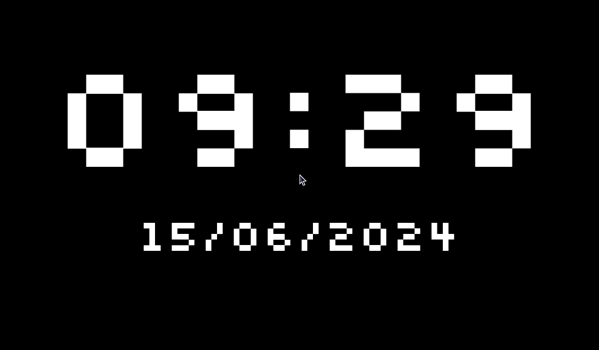
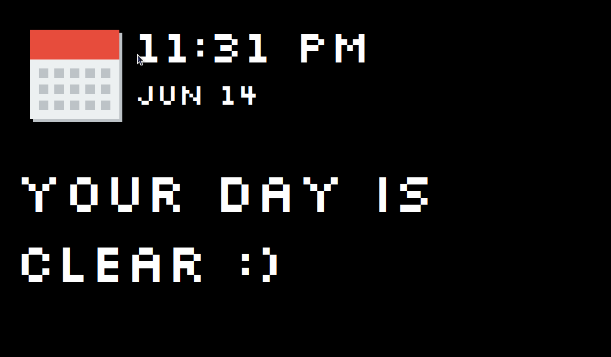

# Pixelbot

A retro-themed display to show ambient information, like the weather,
calendar events, and more.

## Installation

## Hardware

1. Raspberry Pi (tested on a Raspberry Pi 4 and 5, but should work on any model)
2. 7" touchscreen display (1024x600), e.g.
    - [7" HDMI LCD](https://www.waveshare.com/7inch-hdmi-lcd-c.htm)
    - [7" DSI LCD](https://www.waveshare.com/7inch-dsi-lcd-c.htm)
    - [Raspberry Pi 7" Touchscreen Display](https://www.raspberrypi.org/products/raspberry-pi-touch-display/)
      You can use a different display, but you will need to adjust the resolution in the code.

### From source

Should work with Raspberry Pi OS, Debian bookworm, Ubuntu 22.04, and
other Debian-based distributions.

1. Prepare the Raspberry Pi:
    - Install the latest Raspberry Pi OS (Bullseye) with desktop.
    - Enable SSH and VNC in the Raspberry Pi configuration.
    - Update the system:
      ```
      sudo apt update
      sudo apt upgrade
      ```
    - Install the necessary dependencies:
      ```
      sudo apt install \
        python3-wxpython \
        python3-babel \
        python3-requests \
        python3-icalendar
      ```
    - Contrary to established practice, we don't use a virtual environment here as some pre-compiled
      wheels are not available for aarch64 and we don't want to compile them on the Raspberry Pi.
2. Clone the repository
3. Run `python3 -m pixelbot --fullscreen` to start the application.

## Widgets

Pixelbot comes with a few widgets out of the box.
You can add more by creating a new widget in the `widgets` directory.

### Clock

Shows the current time.



### Calendar

Shows the next event in your calendar.


